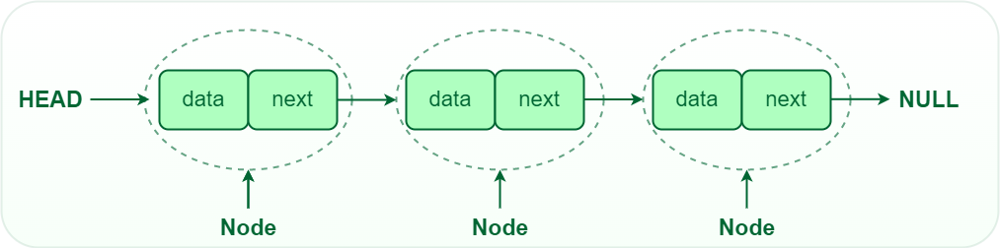

#+Title: Listas

* Introduccion
Las listas son estructuras de datos lineales que permiten almacenar una coleccion ordenada de elementos, donde cada elemento ocupa una posicion logica dentro de la secuencia, a diferencia de los arreglos, las listas no ocupan memoria contigua y su tamaño si es dinamico, es decir puede decrecer o crecer dependiendo de las necesidades del programa.

Esta flexibilidad es fundamental para la construccion de estructuras mas complejas, y como mencionamos anteriormente, cuando necesitamos insertar y eliminar constantemente, entonces si vale la pena priorizar este tipo de estructuras.

* Definicion
/Una coleccion finita y ordenada de elementos del mismo tipo, donde cada elemento, a esxcepcion del primero y ultimo, tiene un predecesor y sucesor/

Podemos verla representada como:
#+begin_src python
L = (e1, e2, e3, ..., en)
#+end_src

- e1 es el primer elemento, denominado como *cabeza*
- en es el ultimo elemento, denominado como *cola*
- n es el numero de elementos en la lista, el tamaño de la lista

Ademas vamos a introducir un concepto fundamental para listas y la mayoria de las estructuras de datos:

*Nodo* se le va a llamar al objeto que va a encapsular al dato o valor guardado, por lo general los nodos tienen "flechas" (apuntadores o direccion de memoria o enlace) a otro nodo, un *apuntador* es una variable que almacena direcciones de memoria.

Veamoslo de esta manera:
#+begin_src java
int variable = 1;
#+end_src
Esta variable almacena un tipo de dato entero, el cual su valor entre todos los enteros posibles es 1.

#+begin_src java
Objeto variable;
#+end_src
Ahora esta variable es de tipo objeto, que realmente por detras lo que hace es almacena una direccion de memoria, entonces sen variable esta la direccion de memoria donde realmente estan almacenado todo lo demas.
#+begin_src java
  public class Main {
      static class MyObject{
  	int x;
      }
      public static void main(String[] args) {
   	MyObject variable = new MyObject();
   	System.out.println(variable);
      }
  }
#+end_src

#+RESULTS:
: Main$MyObject@15db9742

Por ejemplo este es un codigo muy sencillo, vemos que si imprimimos variable, se imprime Main(la clase donde esta contenido) MyObject(clase que estamos instanciando) seguido de unos numeros: /15db9742/, esto en realidad es la direccion de memoria fisica donde esta guardada la instancia variable, entonces volviendo un poco al tema, un apuntador guarda este tipo de datos (direcciones de memoria) y nos va a ayudar a ver el siguiente nodo de la lista.

Como fun fact, cuando declaramos un arreglo, la variable que nombramos es la direccion de memoria del primer indice:

#+begin_src java
  public class Main {
      public static void main(String[] args) {
   	int[] array = new int[10];
   	System.out.println(array);
      }
  }
#+end_src

#+RESULTS:
: [I@2a139a55

Donde 2a139a55 es la direccion de memoria.

Volviendo al concepto de nodo, un nodo entonces se va a componer por dos partes, el tipo de dato que almacena y el apuntador que nos va a ayudar a ir al siguiente nodo.

Como vemos en la siguiente foto, que el nodo tiene dos partes, data que es el valor a guardar y next que es el apuntador, abstraigamos que el apuntador es una flecha que nos dice a donde ir
* Implementacion
** Nodo
Para ver la implementacion de una lista, vamos a comenzar con la implementacion de un nodo, esta implementacion sera clave a la hora de no solo ver como implementar listas, sino todas las estructuras de datos a lo largo del curso.

Primero un nodo se vera definido de la siguiente manera:
#+begin_src java
  class Node{
      T value;
      Node next;
  }
#+end_src

Donde T es el tipo de dato que va almacenar el nodo y node es el apuntador que mencionamos. Ahora va a haber estructuras con doble enlace, la cual se vera de la siguiente manera:
#+begin_src java
  class DoubleLinkedNode{
      T value;
      Node prev;
      Node next;
  }
#+end_src

Vemos que solo se agrega un apuntador al nodo previo, que es la caracteristica de los nodos doblemente enlazados, en el primer nodo es algo que se tiene que memorizar como si fuera agua, ya que todas las estructuras usan como base nodos para su construccion e implementacion.
** Apuntadores auxiliares
Antes de ver las operaciones sobre la lista, vamos a tener 2 apuntadores clave que nos van a ayudar a realizar las operaciones de mejor manera sobre las listas, estos seran:
#+begin_src java
  Node head;
  Node tail;
#+end_src
Los cuales como su nombre lo deduce, van a apuntar al primer y ultimo nodo de la lista respectivamente, si estos dos valores tienen un valor de _null_, entonces quiere decir que la lista esta vacia.
** Insercion
Para la insercion en una lista tenemos 3 posibilidades, insertar al inicio, insertar al final, o insertar en la i-esima posicion, cubriremos las 3 inserciones
*** Al inicio
Como podemos deducir, head sera el nodo a modificar y el cual usaremos a la insercion, sabemos que head apunta al primer elemento de la lista, pero el elemento que vamos a insertar ahora sera el primero, por lo que entonces, primero que nada creamos un nuevo nodo:
#+begin_src java
Node new_node = new Node(valor_del_nuevo_nodo);
#+end_src
Y el siguiente nodo de este nuevo nodo el cual va a ser nuestro primer elemento, es el actual primer elemento de la lista, que ahora pasara a ser el segundo, pero este todavia primer elemento esta almacenado en /head/
#+begin_src java
new_node.next = head;
#+end_src
Y ahora head guardara la referencia al nuevo nodo
#+begin_src java
head = new_node;
#+end_src

Solo por ultimo tenemos que verificar si tail es null, porque si tenemos la lista vacia entonces el unico elemento insertado es el primero y el ultimo, por lo que esto seria_
#+begin_src java
  if(tail == null){
      tail = new_node;
  }
#+end_src

Y listo, habremos insertado al inicio de la lista

*** En cierta posicion y al final
En cierta posicion y al final es el mismo caso solo que con la variante que al final es la ultima posicion, asi que primero veamos en cierta posicion:

** Busqueda
La busqueda es fundamental no solo en listas, sino en las estructuras de datos que se veran a lo largo del curso, se inicia con un nodo auxiliar, comunmente denominado curr o aux el cual se va inicializar con lo que valga head, es facil verlo si pensamos que este nodo es una flecha meramente, y va a apuntar al inicio de la lista.
#+begin_src java
Node aux = head;
#+end_src

Tomando en cuenta que no son estructura de datos circulares, es decir en algun momento terminan, sabemos que el ultimo elemento su apuntador, apunta a null, entonces vamos a tomar ese hecho para determinar cuando parar, como aux es la flecha que vamos a mover a traves de toda la lista, entonces esa es la que vamos a comparar con null.

En caso de que el valor de aux sea el que buscamos, regresamos true, sino entonces la flecha va a apuntar al siguiente nodo, que nos pasamos para alla actualizando a aux.next:
#+begin_src java
  while (aux != null){
      if (aux.value == target){
  	return true;
      }
      aux = aux.next;
  }
#+end_src
** Eliminacion
La eliminacion inicia igual que la busqueda, recorremos la lista con un nodo auxiliar, lo que va a cambiar es que pasa cuando encontramos el elemento que queremos eliminar, primero establezcamos la logica de la eliminacion:

Digamos que queremos eliminar a x, tenemos 3 posibles escenarios:
- X es el primer elemento, es decir la cabeza
- X tiene un nodo antes de el que apunta al nodo de x, y a su vez este nodo apunta a otro nodo
- X es el ultimo nodo de la lista

*** Elemento al inicio de la lista
Si esta al inicio de la lista, entonces solo tenemos que "mover" nuestro nodo apuntador al inicio de la lista
#+begin_src java
head = head.next;
#+end_src
Y solo hay que revisar si head quedo null, entonces tail se hace null
#+begin_src java
  if(head == null){
      tail = null;
  }
#+end_src
*** Elemento en medio
Si hay un nodo que apunta entonces vamos a hacer un truco, en lugar de ir buscando aux.value, vamos a buscar aux.next.value, para que nos detengamos justo un nodo antes del nodo a eliminar :
#+begin_src java
while (aux.next.value != target){
      aux = aux.next;
  }
#+end_src
posteriormente sabemos que en aux se contiene el nodo previo, por lo que en teoria solo bastaria con hacer:
#+begin_src java
aux.next = aux.next.next;
#+end_src
Y ya con eso dejamos de referenciar al nodo de enmedio, esto funciona si aux.next no es nulo, que pasa si aux.next es nulo, entonces caemos en el tercer caso
*** Elemento al final
En este caso entonces supongamos que nos paramos en el penultimo nodo, entonces solo basta con hacer que tail apunte a este penultimo nodo, y que next de este penultimo nodo apunte a null ya que este sera el final de la lista:
#+begin_src java
  aux.next = null;
  tail = aux;
#+end_src
*** Implementacion de eliminacion
Obviamente no sabemos donde esta el nodo y es mas, ni sabemos si el elemento a eliminar esta, entonces hay que hacer una implementacion robusta de los 3 casos y sumando que pasa si no esta:
#+begin_src java
  if (head.value == target){
      head = head.next;
      if(head == null){
  	tail = null;
      }
      return true
  }
  aux = head;
  while(aux.next != null && aux.next.value != target){
      aux = aux.next;
  }
  if(aux.next != null){
      Node node_to_remove = aux.next;
      aux.next = aux.next.next;
      if(node_to_remove == tail){
  	tail = aux;
      }
      return true;
  }
  else{
      return false;
  }
#+end_src

Añadimos unas lineas, veamos porque, primero en el while añadimos la condicion:
#+begin_src java
aux.next != null
#+end_src
Esto porque si el elemento no esta en la lista, entonces debemos de parar y sabemos que el ultimo elemento apunta a null, entonces si el siguiente es null, para.

Siguiente tenemos:
#+begin_src java
if(aux.next != null)
#+end_src
Esto porque queremos ver si el while paro porque ya no habia mas nodos despues, o porque encontro el target, en caso de que no encontro el target, regresa false, es decir la eliminacion no se pudo hacer. En caso de que si guardamos aux.next, que es el nodo a eliminar, y hacemos un brinco, recordemos que aux representa en este momento al nodo previo a eliminar, entonces hacemos que este nodo previo ahora apunte al next, que estaba apuntando el nodo a elimninar, por eso aux.next(nodo a eliminar).next(siguiente de este nodo), una vez eso vemos si tenemos que actualizar tail, esto es si el nodo a eliminar es tail, si si entonces tail va a apuntar a aux que es el nodo previo, y regresamos true, es decir eliminacion exitosa.
* Caracteristicas
Las listas presentan las siguientes caracteristicas:
- Estructura lineal: los elementos tienen una secuencia logica
- Orden definido: el orden de insercion es relevante
- Tamaño dinamico: no es necesario definir el tamaño cuando creamos la lista
- Acceso secuencial: para llegar al i-esimo elemento hay que recorrer los anteriores

Ya que sabemos que es una lista y un arreglo vamos armando una tabla comparativa la cual vamos a ir agrandando conforme cubramos mas estructuras de datos
| caracteristica | arreglos       | listas          |
| tamaño         | fijo           | dinamico        |
| uso de memoria | contigua       | dispersa        |
| acceso         | constante O(1) | secuencial O(n) |
| insercion      | O(n) costoso   | eficiente       |
| eliminacion    | O(n) costoso   | eficiente       |

Al decir disperso en memoria es que recordemos que habiamos dicho que los arreglos ocupaban bloques de memoria contiguos en la memoria del programa, las listas cada elemento (nodo) ocupa una ubicacion de memoria y no necesariamente el nodo siguiente esta en la siguiente direccion de memoria.

* Tipos de listas
** Lista simplemente enlazada:
Este es la lista mas basica, cada elemento contiene:
- *value*: un dato
- *next*: una referencia al siguiente elemento

Caracteristicas importantes:
- Recorrido en una sola direccion
- menor consumo de memoria que otro tipo de listas
- no permite regresar, es decir una vez que avanzamos al siguiente nodo, no podemos regresar al anterior a menos que iniciemos de nuevo el recorrido

** Lista doblemente enlazada
Cada nodo contiene:
- *value*: un dato
- *next*: una referencia al siguiente nodo
- *prev*: una referencia al nodo previo

Caracteristicas:
- Podemnos recorrer en ambos sentidos
- Es mas facil eliminar nodos intermedios
- Consume mas memoria ya que agregamos una variable mas por cada nodo

** Lista circular
Cada nodo es igual que una lista simplemente enlazada, a diferencia que el ultimo nodo apunta al primero, por lo que no existe un null al final de la lista

Al igual que las listas enlazadas, pueden ser simplemente circular (en un sentido) o doblemente circular.

Son utiles en planificacion de procesos, turnos y estructuras ciclicas.

* Operaciones fundamentales
- Crear lista
- Insertar elementos: en la i-esima posicion
- Eliminar elementos: en la i-esima posicion, por su valor
- Buscar un elemento
- Recorrer la lista
- Obtener tamaño
- Preguntar si esta vacia

Ahora veamos el costo de estas operaciones:
| operacion                        | complejidad |
| insercion al inicio y al final   | O(1)        |
| insercio en la i-esima posicion  | O(n)        |
| eliminacion                      | O(n)        |
| eliminacion al inicio y al final | O(1)        |
| busqueda                         | O(n)        |
| preguntar si es vacia            | O(1)        |
